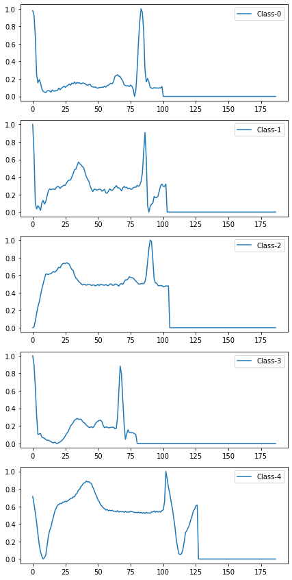

# ECG Classification
A review and work on classifying ECG signals.

The data-set belongs to 
[MIT-BIH Arrhythmia Database](https://physionet.org/content/mitdb/1.0.0/)

The data contains 109446 ECG signals and each one has 187 samples.
The signals are labeled into 5 different classes.
The below table describes the data-set: 

|Metric |Value|
|-------------------|----|
| Number of samples | 109446  |
| Length of signals | 187  |
| Number of classes | 5  |

These figures depicts more information around ECG classes.

|ECG Class | Abstraction | Description |
|-------------------|----| ----- |
| 0 | N | Normal |
| 1 | S | Supraventricular ectopic |
| 2 | V | Ventricular ectopic |
| 3 | F | Fusion |
| 4 | Q | Unknown |

